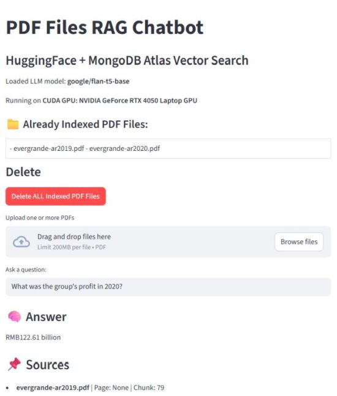

# PDF Files RAG Chatbot

A Streamlit web app that enables **Retrieval-Augmented Generation (RAG)** on PDF documents using:

- PDF text extraction
- Sentence embeddings with SentenceTransformers
- Large Language Model (LLM) for answer generation (HuggingFace transformers)
- Vector similarity search on MongoDB Atlas
- Chunking of long documents for efficient retrieval

---

## Features

- Upload one or more PDF files and index their contents by splitting into chunks and storing embeddings in MongoDB.
- Perform semantic search over PDF content using vector similarity search.
- Ask natural language questions and receive context-aware answers generated by a pretrained LLM.
- Delete all indexed PDFs and embeddings from the database.
- View already indexed PDF files in the app.
- Supports GPU acceleration (if available) for faster model inference.




---

## Installation

1. Clone the repo:

   ```bash
   git clone https://github.com/econexpert/LLMwithRAG.git
   cd LLMwithRAG

2. Add vector search index:


- Open MongoDB Atlas Console and navigate to your cluster.

- Go to your database and then your collection (e.g., vectors).

- Click the Indexes tab.

- Click Create Index.

- Choose JSON Editor mode.

- Paste the JSON configuration above.

- Give the index a name, for example, "vector_index".

- Click Create to build the index.

```
{
  "fields": [
    {
      "type": "vector",
      "path": "embedding",
      "numDimensions": 384,
      "similarity": "cosine"
    }
  ]
}
```


3. Create a Virtual Environment

It’s best practice to create a virtual environment to isolate your project dependencies.

On macOS/Linux:
```
python3 -m venv venv
source venv/bin/activate
```

On Windows (Command Prompt):
```
python -m venv venv
venv\Scripts\activate
```

On Windows (PowerShell):
```
python -m venv venv
.\venv\Scripts\Activate.ps1
```
2. Install Dependencies

Make sure you have a requirements.txt file in your project folder listing the required packages. Then run:
```
pip install -r requirements.txt
```
3. Run the Streamlit App

With the environment activated, start your app by running:
```
streamlit run app.py
```

This will launch the Streamlit server and open your app in a browser window (usually at http://localhost:8501).

## Requirements

- Python 3.8+
- MongoDB Atlas account (free tier works)
- CUDA-enabled GPU (optional, for faster inference)
- Python packages listed in `requirements.txt` including:
  - `streamlit`
  - `pypdf`
  - `sentence-transformers`
  - `transformers`
  - `torch`
  - `pymongo`
  - `langchain_text_splitters`
  - `numpy`
